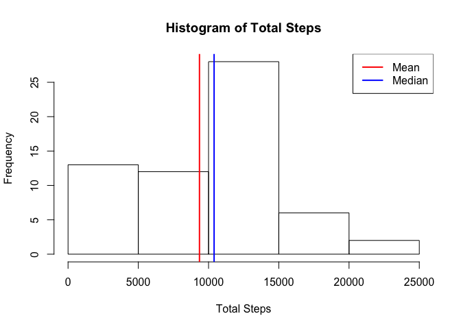
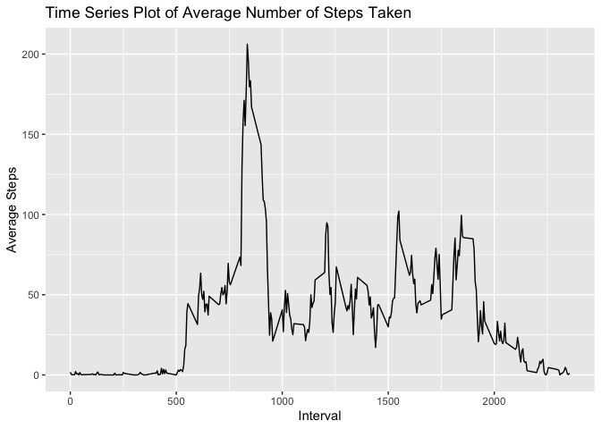
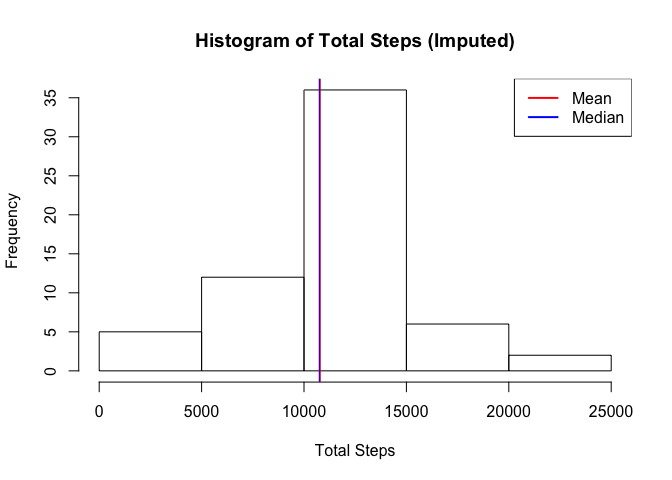
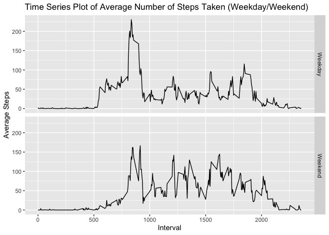

## Loading and preprocessing the data

```r
activitydata <- read.csv("activity.csv")
```

## What is mean total number of steps taken per day?
  
First let's calculate the total number of steps taken each day.  

```r
library(dplyr)
totalsteps <- activitydata %>% 
        group_by(date) %>% 
        summarise(totalSteps = sum(steps,na.rm = TRUE))
```
  
A histogram of the total number of steps taken each day is as shown below.  

```r
hist(totalsteps$totalSteps, main = "Histogram of Total Steps", xlab = "Total Steps")
abline(v = mean(totalsteps$totalSteps), col = "red", lwd = 2)
abline(v = median(totalsteps$totalSteps), col = "blue", lwd = 2)
legend("topright", legend = c("Mean","Median"), lwd = 2, col = c("red","blue"))
```

<!-- -->

Let's calculate the mean and median total number of steps taken per day.  

```r
meanTotalSteps <- round(mean(totalsteps$totalSteps), digits = 2)
medianTotalSteps <- median(totalsteps$totalSteps)
```
- The **_mean_** total number of steps taken each day is **_9354.23_**.  
- The **_median_** total number of steps taken each day is 
**_10395_**.  

## What is the average daily activity pattern?

First let's calculate the average number of steps taken in a given 5-minute 
interval, averaged across all days.

```r
avgDailyActivity <- activitydata %>% 
        group_by(interval) %>% 
        summarise(avgSteps = mean(steps,na.rm = TRUE))
```
  
A time series plot of the 5-minute interval and the average number of steps 
taken is shown below.

```r
library(ggplot2)
ggplot(data = avgDailyActivity, aes(x = interval, y = avgSteps)) + 
        geom_line() +
        labs(title = "Time Series Plot of Average Number of Steps Taken", 
             x = "Interval", y = "Average Steps")
```

<!-- -->

Let's find the 5-minute interval that, on average across all the days in the 
dataset, contains the maximum number of steps.


```r
maxSteps <- max(avgDailyActivity$avgSteps)
interval <- avgDailyActivity$interval[avgDailyActivity$avgSteps == maxSteps]
```
- The interval with maximum number of steps is **_835_** and the 
average number of steps taken in this interval across all days is 
**_206.17_**
  
## Imputing missing values

First let's find the total number of missing values in the dataset.  
  

```r
missingValues <- sum(!complete.cases(activitydata))
```

- There are **_2304_** missing vales in the dataset.  

  
Let's replace the missing values in steps with the mean value of steps for that 
5-minute interval across all days.  
  

```r
imputedData <- activitydata %>% 
        inner_join(avgDailyActivity, by="interval")
imputedData$steps <- coalesce(imputedData$steps, imputedData$avgSteps)  
imputedData <- imputedData %>% select(steps, date, interval)
```

Let's now calculate the total number of steps taken each day based on the 
imputed data.  
  

```r
library(dplyr)
totalstepsimputed <- imputedData %>% 
        group_by(date) %>% 
        summarise(totalSteps = sum(steps,na.rm = TRUE))
```

A histogram of the total number of steps taken each day based on the imputed 
data is as shown below.  
  

```r
hist(totalstepsimputed$totalSteps, 
     main = "Histogram of Total Steps (Imputed)", 
     xlab = "Total Steps")
abline(v = mean(totalstepsimputed$totalSteps), col = "red", lwd = 2)
abline(v = median(totalstepsimputed$totalSteps), col = "blue", lwd = 1)
legend("topright", legend = c("Mean","Median"), lwd = 2, col = c("red","blue"))
```

<!-- -->

Let's now calculate the mean and median total number of steps taken per day with 
the imputed data.  
  

```r
meanTotalStepsImputed <- round(mean(totalstepsimputed$totalSteps), digits = 2)
medianTotalStepsImputed <- round(median(totalstepsimputed$totalSteps), digits = 2)
```
- The **_mean_** total number of steps taken each day is **_10766.19_**.  
- The **_median_** total number of steps taken each day is 
**_10766.19_**.  

The mean and median total number of steps taken per day with original data 
ignoring the missing values is shown below  

- The **_mean_** total number of steps taken each day is **_9354.23_**.  
- The **_median_** total number of steps taken each day is 
**_10395_**.  
  
As we can see from the calculations above, both the mean and median values have 
increased once we imputed the data and considered the imputed values in our 
calculation. Imputing missing data has increased the estimates of the total 
daily number of steps.  
  
## Are there differences in activity patterns between weekdays and weekends?

Let's fist add a column to our dataset to indicate whether a given day is a 
weekend or weekday.  

```r
library(chron)
imputedData$day <- ifelse(is.weekend(as.Date(imputedData$date, 
                                             format = "%Y-%m-%d")), 
                                     "Weekend", "Weekday")
```

The panel plot containing a time series plot of the 5-minute interval (x-axis) 
and the average number of steps taken, averaged across all weekday days or 
weekend days (y-axis) is shown below.  


```r
library(ggplot2)
avgActivityData <- imputedData %>% group_by(day, interval) %>% 
        summarise(avgSteps = mean(steps))

ggplot(data = avgActivityData, aes(interval,avgSteps)) +
        geom_line() + 
        facet_grid(day ~ .) +
        labs(x = "Interval", y = "Average Steps", 
             title = "Time Series Plot of Average Number of Steps Taken (Weekday/Weekend)")
```

<!-- -->
